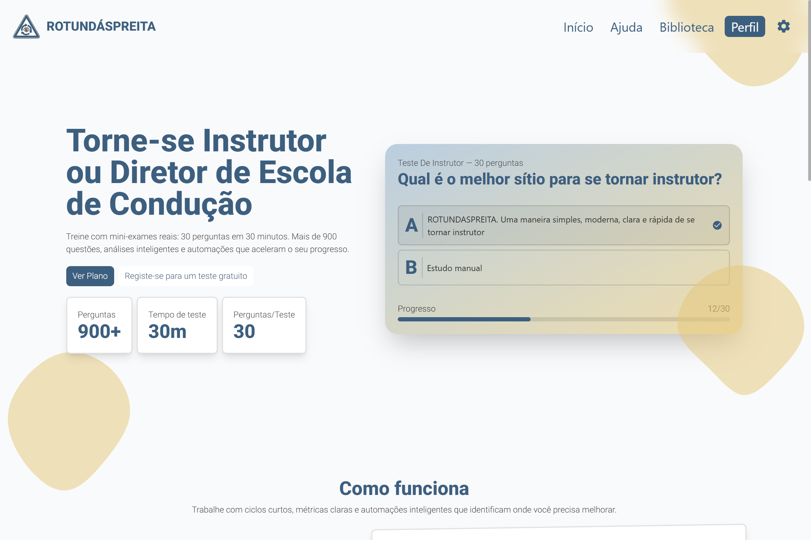
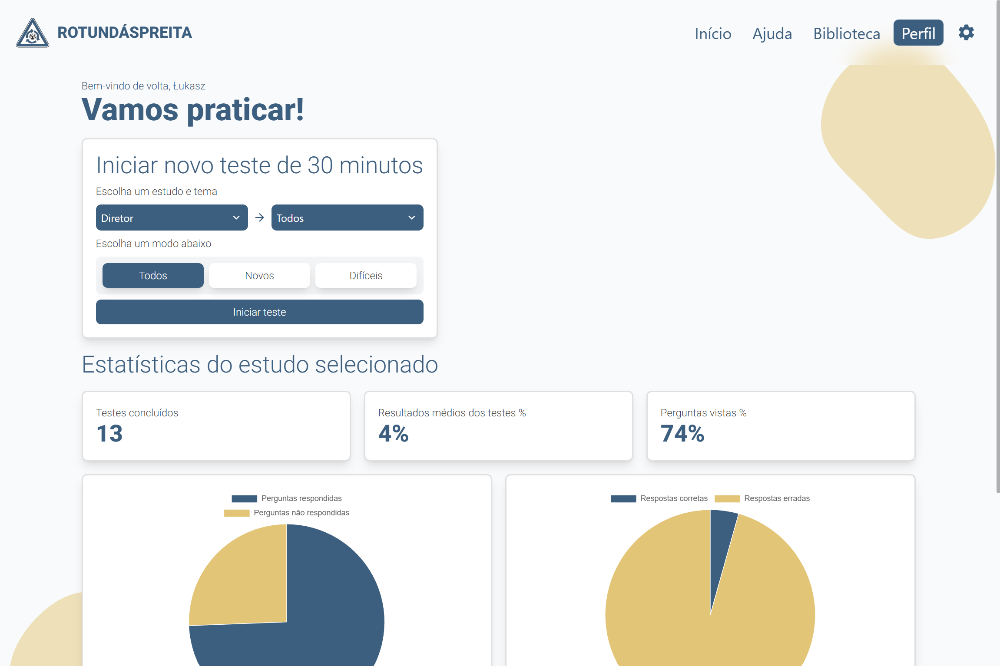
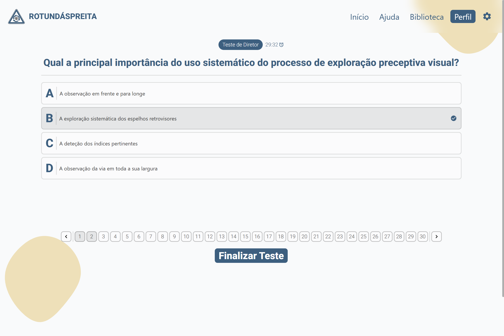
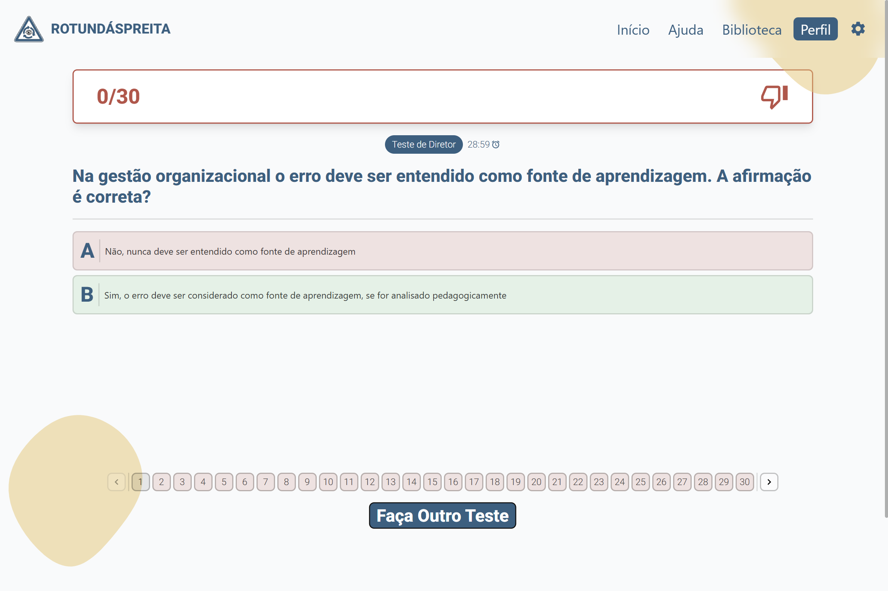
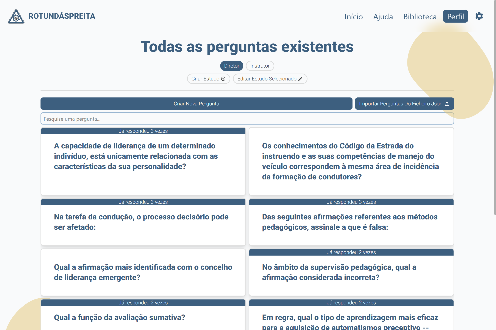

# ROTUNDÁSPREITA

  

## 🚗 About

**ROTUNDÁSPREITA** is a web application built for learners in **Portugal** preparing to become **driving instructors** or **driving school directors**. The platform helps users get ready for official exams by offering a premium subscription to a large, verified question bank and powerful learning tools.

Users with a subscription get access to:

-   ✅ **900+ verified questions** tailored for instructor/director exams. Ideal for efficient exam preparation
    
-   📊 **Advanced analytics** to track strengths, weaknesses, and performance trends
    
-   🧠 **Clean, distraction-free test interface** designed for deep focus and realistic practice
    
-   🔄 **Unlimited mock test attempts** for boosted confidence
    

Learn more at 🔗 [https://rotundaspreita.com](https://rotundaspreita.com)

----------

## 📸 Screenshots

### 📋 Panel / Dashboard

  
### 📃 Test Interface

  

### ✅ Finished Test Interface

  

### 📚 Library Interface

  

----------

## 🛠 Technologies

ROTUNDÁSPREITA is built using modern web technologies to ensure strong performance, scalability, and excellent user experience:

-   **Next.js** – Full-stack React framework
    
-   **React** – UI library
    
-   **Tailwind CSS** – Utility-first styling
    
-   **TypeScript** – Type safety
    
-   **Prisma** – ORM for database access
    
-   **PostgreSQL** – Relational database
    
-   **HeadlessUI** – Accessible UI components
    
-   **JWT** – Authentication
    
-   **Stripe** – Payments/subscriptions